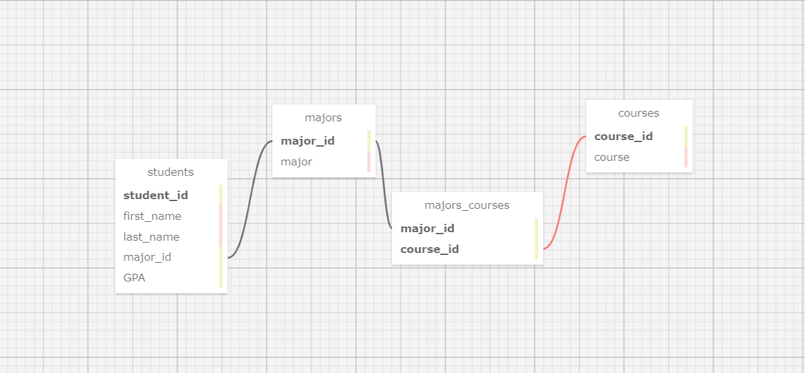
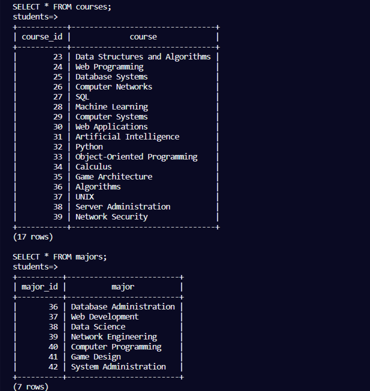
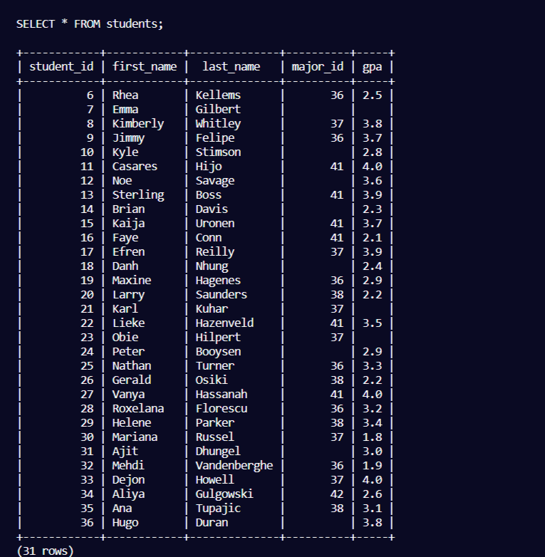
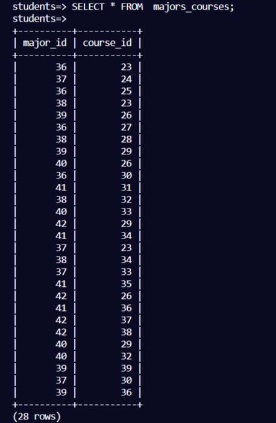
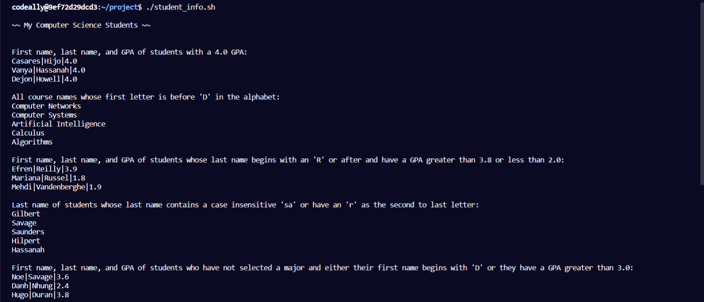
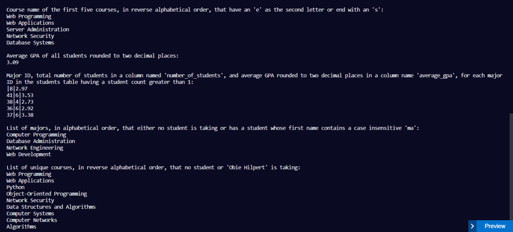

## Banco de dados de Alunos, Cursos e Disciplinas

##### Modelagem de um banco de dados relacional de estudantes de uma universidade, assim como a inserção de dados de dois arquivos CSV (um para os [cursos](courses.csv) e outro para os [alunos](students.csv)) utilizando [script BASH shell](insert_data.sh) , e também a consulta de informações através de queries, em [outro script BASH shell](students_info.sh).

Utilizando o PostgreSQL construi esse banco de dados seguindo o seguinte modelo:



Para a inserção dos dados, desenvolvi um script shell, que lê arquivos CSV enquanto salva em variáveis e depois insere no banco de dados em loop:
```
# Exemplo da inserção dos cursos(o método para as disciplinas e alunos é o mesmo):

PSQL="psql -X --username=freecodecamp --dbname=students --no-align --tuples-only -c"

cat courses.csv | while IFS="," read MAJOR COURSE
do
  if [[ $MAJOR != "major" ]]
  then
    # get major_id
    MAJOR_ID=$($PSQL "SELECT major_id FROM majors WHERE major='$MAJOR'")

    # if not found
    if [[ -z $MAJOR_ID ]]
    then
      # insert major
      INSERT_MAJOR_RESULT=$($PSQL "INSERT INTO majors(major) VALUES('$MAJOR')")
      if [[ $INSERT_MAJOR_RESULT == "INSERT 0 1" ]]
      then
        echo Inserted into majors, $MAJOR
      fi

      # get new major_id
      MAJOR_ID=$($PSQL "SELECT major_id FROM majors WHERE major='$MAJOR'")
    fi

```
Após a execução do script, as tabelas ficaram populadas assim:

 - tabelas de cursos e disciplinas:
 

 - tabelas de alunos:
 

 - tabela de relação curso_disciplina:
 


---


###### Consulta de informações utilizando queries SQL:

Para consultar dados significativos com queries SQL, também desenvolvi um [script shell que realiza as queries](students_info.sh). O output no terminal desse script ficou assim:





---

Com esse projeto eu aprendi MUITO, manipulação de arquivos com BASH, além de piping, comparações numéricas, comparações de string, execução de expressões, variáveis e muito mais... E isso só de bash scripting...

Sobre SQL eu realmente adquiri expertise em queries, e utilizei diversas funções, JOINs, ordenação, agrupamento e bem mais.

E o mais importante de tudo, eu me diverti pra caramba com esse projeto! 

Para aqueles que possuem um ambiente linux e quiserem ver esse projeto em sua máquina, siga os passos a seguir:

> 1. Instale o postgreSQL em sua máquina
>
> 2. insira o comando `psql students < students.sql` que vai ciar o BD sem os dados ou `psql students < students_full.sql` que já cria o BD populado!
>
> 3. Caso tenha criado só o modelo sem os dados, execute o script que insere os dados `./insert_data.sh`
>
> 4. Agora finalmente, execute o script com as queries `./students_info.sh`
